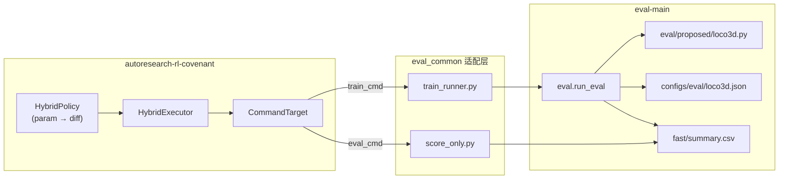

# 如何适配其他评估及算法框架

本文档说明 **eval-main**（ShapeLLM mesh token 剪枝评测）与 **autoresearch-rl-covenant**（AutoResearch 自动实验循环）之间的集成设计，以及将同一套 autoresearch 流水线迁移到其他 **Evaluate 框架** 或 **算法实现框架** 时需要修改的具体位置与代码契约。

相关仓库布局（同级目录）：

```
Speculative Decoding/
├── eval-main/                          # 本仓库：VLM 评测 harness + pruner 插件
└── autoresearch-rl-covenant/           # 自动搜索循环 + eval 薄适配层
    └── examples/eval-{loco3d,...}/     # 针对 eval-main 的 campaign 配置
    └── examples/eval_common/           # 共享的 train/score/prepare 逻辑
```

---

## 1. 整体架构

### 1.1 两个项目的职责划分

| 组件 | 职责 | 是否被 LLM 修改 |
|------|------|----------------|
| **eval-main** | 数据加载、体素化、VQVAE、VLM 生成、BLEU/ROUGE、剪枝器注册与调用 | **Harness 冻结**（`eval/run_eval.py` 等） |
| **eval/proposed/*.py** | 具体剪枝算法（如 `loco3d.py`） | **Diff 阶段可变** |
| **configs/eval/*.json** | 剪枝器超参 | **Param 阶段可变** |
| **autoresearch-rl-covenant** | LLM 提案、keep/discard、checkpoint、Contract 校验 | 框架本身通用 |
| **examples/eval_common/** | 把 autoresearch 的 `train_cmd` 接到 `eval.run_eval` | **换 eval 框架时主要改这里** |

设计原则（来自 autoresearch README）：**prepare / train 通过文件系统和子进程通信，不互相 import 核心逻辑**。eval-main 是重量级 GPU 进程，适配层只做「启动命令 + 解析 stdout + 写 JSON 超参」。

### 1.2 数据流（一次 hybrid 迭代）



---

## 2. eval-main 侧：评测 Harness 设计

### 2.1 剪枝器插件 API（算法框架契约）

所有可搜索的「算法」必须实现统一 pruner 接口，并通过装饰器注册：

```15:63:eval-main/eval/pruners/__init__.py
def register_pruner(name: str):
    """Decorator to register a pruner class under ``name``."""
    ...

class BasePruner(ABC):
    def __init__(self, keep_ratio: float = 1.0, seed: int = 42, **kwargs):
        ...

    @abstractmethod
    def prune(
        self,
        token_ids: torch.Tensor,
        voxel_grid: torch.Tensor | None = None,
        **kwargs: Any,
    ) -> Tuple[torch.Tensor, Dict[str, Any]]:
        ...
```

**autoresearch diff 校验**（`pruner_check.py`）会强制保留：

- `@register_pruner("xxx")` 装饰的类名；
- 类上的 `prune` 方法（`eval.run_eval` 唯一调用入口）。

示例（loco3d 注册与 `prune` 签名）：

```205:214:eval-main/eval/proposed/loco3d.py
@register_pruner("loco3d")
class Loco3DPruner(BasePruner):
    """V16: neighbor variance + balanced quotas (more fill), reduced surface bonus."""

    def prune(
        self,
        token_ids: torch.Tensor,
        voxel_grid: torch.Tensor | None = None,
        **kwargs: Any,
    ) -> Tuple[torch.Tensor, Dict[str, Any]]:
```

新增算法时：在 `eval/proposed/` 或 `eval/baseline/` 下新建模块，并在 `eval/run_eval.py` 顶部 import 以触发注册（与现有 baseline 相同模式）。

### 2.2 超参加载（Param 搜索契约）

Harness 从 `configs/eval/{pruner_name}.json` 读取额外 kwargs，合并进 pruner 构造函数：

```144:153:eval-main/eval/config.py
def load_pruner_extra_kwargs(config_dir: Path, pruner_name: str) -> Dict[str, Any]:
    """Load ``{config_dir}/{pruner_name}.json`` if present; otherwise empty dict."""
    path = config_dir / f"{pruner_name}.json"
    if not path.is_file():
        return {}
    with open(path, encoding="utf-8") as f:
        data = json.load(f)
    ...
    return data
```

运行时实例化（autoresearch 的 param 阶段就是改写这个 JSON）：

```323:341:eval-main/eval/run_eval.py
                for pname in cfg.pruners:
                    Pruner = get_pruner_class(pname)
                    for kr in cfg.keep_ratios:
                        ...
                        extra = load_pruner_extra_kwargs(eval_cfg_dir, pname)
                        pruner = Pruner(keep_ratio=kr, seed=cfg.seed, **extra)
                        ...
                            pruned_ids, meta = pruner.prune(
                                token_ids,
                                voxel_grid,
                                vq_embeddings=vq_emb,
                                _log_sample_idx=si,
                                _log_tag=sample.file_identifier,
                                _log_keep_ratio=float(kr),
                            )
```

示例 JSON（`configs/eval/loco3d.json`）：

```json
{
  "adaptive_threshold": true,
  "threshold": 1.0,
  "target_surface_share": 0.5,
  "target_fill_share": 0.35
}
```

### 2.3 评测产物（文件契约）

一次 `run_eval` 结束后，在 `--output-dir` 下生成：

| 文件 | 用途 |
|------|------|
| `results.json` | 样本 × pruner × keep_ratio 明细 |
| `summary.csv` | 按 pruner + keep_ratio 聚合（BLEU/ROUGE 等） |
| `by_pruner/<name>.json` | 按方法拆分 |
| `logs/<pruner>.log` | 剪枝诊断（含 `prune_done` 行，供 LLM digest） |

autoresearch 约定每轮迭代输出到 `$AR_RUN_DIR/fast/`（由 `eval_budget.yaml` 的 `output_subdir` 控制）。

### 2.4 与 autoresearch 集成的专用模块：`eval/score_eval_run.py`

为自动搜索定义的 **单一目标标量** `eval_score`（composite metric）：

```58:93:eval-main/eval/score_eval_run.py
def compute_eval_score(
    rows: List[Dict[str, Any]],
    *,
    w_rl_at_03: float = 1.0,
    kr_low_focus: float = 0.3,
) -> Tuple[float, Dict[str, float]]:
    """Mean composite over keep_ratio rows; optional extra weight at low keep_ratio."""
    ...
    for row in rows:
        c = row_composite(row)   # 0.5*rouge_l + 0.3*bleu_4 + 0.2*bleu_1
        kr = float(row["keep_ratio"])
        w = w_rl_at_03 if abs(kr - kr_low_focus) < 1e-6 else 1.0
        ...
```

`run_eval` 结束时打印 stdout 行（**autoresearch 解析入口**）：

```449:458:eval-main/eval/run_eval.py
    if ok and Path(out_csv).is_file():
        from eval.score_eval_run import score_from_summary_file

        for pname in cfg.pruners:
            score, extras = score_from_summary_file(Path(out_csv), pname)
            print(f"eval_score={score:.6f}", flush=True)
            print(f"rouge_l_mean={extras.get('rouge_l_mean', 0.0):.6f}", flush=True)
            print(f"bleu_4_mean={extras.get('bleu_4_mean', 0.0):.6f}", flush=True)
            print(f"bleu_1_mean={extras.get('bleu_1_mean', 0.0):.6f}", flush=True)
            print(f"pruner={pname}", flush=True)
```

**迁移到其他 eval 框架时**：新框架也必须在评测结束时向 stdout 打印同名行，或改 autoresearch 的 `_STDOUT_METRIC_KEYS` 与 `objective.metric`。

### 2.5 诊断日志契约（LLM 上下文，可选但强烈建议）

loco3d 等在剪枝结束时打印结构化 `prune_done` 行，供 `eval_log_digest.py` 解析：

```238:240:eval-main/eval/proposed/loco3d.py
        logger.info(
            f"prune_start kr={float(log_kr):.4g} tag={log_tag} k_target={k_target} device={device}"
        )
```

（完整 `prune_done` 行在同文件后续 `logger.info(...)` 中，字段含 `k_quota`、`kept(surf/fill/empty)`、`score_rank_mean` 等。）

若新算法框架无类似日志，LLM 在 diff 阶段只能依赖 `eval_score` 数值，搜索效率会明显下降。

---

## 3. autoresearch-rl-covenant 侧：eval 适配层

适配代码 **不在 eval-main 内**，而在 sibling 仓库的 `examples/eval_common/` 与各 campaign 目录。理解这些文件是迁移的关键。

### 3.1 Campaign 配置（`config.yaml`）

以 eval-loco3d 为例（路径相对于 autoresearch-rl-covenant 根目录）：

```yaml
# autoresearch-rl-covenant/examples/eval-loco3d/config.yaml（结构摘要）
target:
  type: command
  workdir: ../eval-main          # 子进程 cwd
  prepare_cmd: [python3, .../prepare.py]
  train_cmd:   [python3, -u, .../train.py]
  eval_cmd:    [python3, -u, .../score_only.py]

policy:
  type: hybrid
  mutable_file: ../eval-main/eval/proposed/loco3d.py   # diff 唯一目标
  frozen_file:  ../eval-main/eval/run_eval.py            # contract 禁止修改
  program_file: examples/eval-loco3d/program.md          # LLM 任务说明

objective:
  metric: eval_score
  direction: max
```

### 3.2 环境变量协议（CommandTarget → 适配脚本）

`CommandTarget._run` 在每次 train/eval 子进程前注入：

```94:105:autoresearch-rl-covenant/src/autoresearch_rl/target/command.py
    def _run(self, *, cmd: list[str], run_dir: str, params: dict[str, object]) -> RunOutcome:
        env = os.environ.copy()
        env["AR_RUN_DIR"] = run_dir
        ...
        env["AR_PARAMS_JSON"] = json.dumps(params)
        for k, v in params.items():
            env[f"AR_PARAM_{str(k).upper()}"] = str(v)
```

| 变量 | 含义 |
|------|------|
| `AR_RUN_DIR` | 本轮 artifact 根目录（含 `fast/summary.csv`） |
| `AR_PARAMS_JSON` | LLM param 提案（JSON 字符串） |
| `EVAL_MAIN_ROOT` | eval-main 绝对路径（默认 `../eval-main`） |
| `AR_SMOKE_DRY=1` | 跳过 VLM，固定假分数 |
| `AR_VERBOSE=1` | 子进程 stdout 实时 tee 到终端 |
| `AR_EVAL_BUDGET_FILE` | 覆盖默认 `eval_budget.yaml` 文件名 |
| `AR_BUDGET_JSON` | 运行时覆盖 budget/promotion/scoring |

### 3.3 train_runner：启动完整评测

核心逻辑：合并 budget → 写 pruner JSON → `subprocess` 调用 `eval.run_eval` → 从 log 读取 `eval_score=`。

```108:188:autoresearch-rl-covenant/examples/eval_common/train_runner.py
    params = env_params()
    apply_pruner_json(eval_root, pruner, params, skip_keys=_SKIP_JSON_KEYS)
    ...
    cmd = [
        sys.executable, "-u", "-m", "eval.run_eval",
        "--data-csv", data_csv,
        "--glb-dir", glb_dir,
        "--num-samples", str(num_samples),
        "--output-dir", output_dir,
        "--pruners", pruner,
        "--keep-ratios", keep_ratios,
        "--device", device,
        "--vqvae-device", vqvae_device,
        ...
    ]
```

`_SKIP_JSON_KEYS` 把 **评测预算**（`num_samples`、`device`…）与 **算法超参** 分开：前者来自 `eval_budget.yaml`，后者由 LLM 写入 JSON。

```246:255:autoresearch-rl-covenant/examples/eval_common/train_runner.py
    log_text = log_path.read_text(encoding="utf-8", errors="replace")
    for line in reversed(log_text.splitlines()):
        s = line.strip()
        if s.startswith("eval_score="):
            print(s, flush=True)
            ...
            return 0
```

### 3.4 score_only：轻量二次打分（不重复跑 VLM）

```21:83:autoresearch-rl-covenant/examples/eval_common/score_only.py
def main(campaign_dir: Path, pruner: str) -> int:
    ...
    summary = Path(run_dir) / out_sub / "summary.csv"
    ...
    from eval.score_eval_run import score_from_summary_file
    score, extras = score_from_summary_file(summary, pruner, w_rl_at_03=w)
    print(f"eval_score={score:.6f}", flush=True)
```

Controller 的 `TargetExecutor` 流程：**train_cmd 跑完 VLM → eval_cmd 只读 CSV 重算分**，避免 7B 模型跑两遍。

### 3.5 budget.py：路径解析与 JSON 写入

```79:107:autoresearch-rl-covenant/examples/eval_common/budget.py
def resolve_eval_main_root(campaign_dir: Path) -> Path:
    env_root = os.environ.get("EVAL_MAIN_ROOT", "").strip()
    if env_root:
        return Path(env_root).resolve()
    covenant_root = campaign_dir.parent.parent
    return (covenant_root.parent / "eval-main").resolve()

def apply_pruner_json(eval_root, pruner, params, *, skip_keys=...):
    cfg_path = eval_root / "configs" / "eval" / f"{pruner}.json"
    ...
    cfg_path.write_text(json.dumps(base, indent=2) + "\n", encoding="utf-8")
```

### 3.6 Hybrid 执行与 Contract（代码 diff 路径）

**Param 提案** → `TargetExecutor` → 直接跑 train/eval，不改磁盘上的 pruner 源码。

**Diff 提案** → `DiffExecutor`：

1. `validate_diff`（AST、禁止 socket/subprocess 等）；
2. `validate_diff_against_contract`（只能改 `mutable_file`）；
3. `validate_pruner_patch`（不能删 `prune` / 仍被调用的 helper）；
4. 临时写盘 → train/eval → **finally 恢复原文件**；
5. keep 时 `_persist_diff` 永久写入。

Contract 规则：

```31:52:autoresearch-rl-covenant/src/autoresearch_rl/controller/contract.py
def validate_diff_against_contract(diff: str, contract: ContractConfig) -> tuple[bool, str]:
    touched = extract_touched_files_from_diff(diff)
    ...
    for path in touched:
        key = _contract_basename(path)
        if key == frozen:
            return False, f"frozen_file_mutation_blocked:{path}"
        if key != mutable:
            return False, f"out_of_scope_mutation_blocked:{path} ..."
```

Hybrid 组装（框架 core，一般不需为换 eval 而改）：

```247:256:autoresearch-rl-covenant/src/autoresearch_rl/controller/continuous.py
    target_exec = TargetExecutor(target)
    diff_exec = DiffExecutor(target, mutable_file, contract)
    executor = HybridExecutor(target_exec, diff_exec)
```

### 3.7 LLM 诊断摘要（eval-main 日志强耦合）

每轮结束后 `engine.py` 调用 `build_eval_digest(run_dir, stdout)`，写入 history 的 `eval_diagnostic`，供 hybrid prompt 使用：

```675:714:autoresearch-rl-covenant/src/autoresearch_rl/policy/eval_log_digest.py
def build_eval_digest(run_dir: str, stdout_fallback: str = "") -> str:
    """Summarize last eval: aggregate + single-sample prune_done trace (~3.5k chars)."""
    fast = Path(run_dir) / "fast"
    results_path = fast / "results.json"
    ...
    prune_rows = _load_prune_rows(run_path, stdout_fallback or "")
    ...
    elif not trace:
        lines.append(
            "  No prune_done parsed (check results.json diagnostics, "
            "stdout, and fast/logs/loco3d.log)."
        )
```

依赖 eval-main 的目录布局：`$AR_RUN_DIR/fast/results.json`、`fast/logs/*.log`、stdout 中的 `prune_done`。

---

## 4. 关键设计决策总结

| 设计 | 动机 | 涉及代码 |
|------|------|----------|
| **子进程 + stdout 协议** | eval-main 依赖 CUDA/VLM，不宜被框架 import | `target/command.py`, `train_runner.py` |
| **train / eval_cmd 分离** | VLM 评测极慢，controller 需要两阶段 metrics | `executor.py` TargetExecutor |
| **mutable = 单文件 pruner** | 缩小 LLM 搜索空间，保证 harness 可信 | `contract.py`, `program.md` |
| **JSON 超参 vs Python diff** | 先 cheap 调参，停滞后再改算法 | `hybrid.py`, `apply_pruner_json` |
| **eval_score 单一目标** | keep/discard 与 checkpoint 只认一个 float | `score_eval_run.py`, `objective.metric` |
| **apply 后 AST + pruner API 校验** | 避免跑 150s VLM 才发现 NameError | `validator.py`, `pruner_check.py` |
| **discard 时 rollback 源码** | 失败实验不污染 git 工作区 | `diff_executor.py` finally 块 |
| **eval_log_digest** | 让 LLM 看见 quota/kept 等中间量，而不只是 BLEU | `eval_log_digest.py`, loco3d `prune_done` |

---

## 5. 迁移到其他 Evaluate 框架

以下假设你要把 autoresearch 接到 **完全不同的评测系统**（例如 OpenCompass、lm-eval-harness、自定义 REST 服务），而不是继续用 eval-main。

### 5.1 必须实现的契约（最小可行集成）

#### （1）stdout 指标行

框架从子进程 stdout 解析（精确 `key=value` 行）：

```18:29:autoresearch-rl-covenant/src/autoresearch_rl/target/command.py
_STDOUT_METRIC_KEYS = frozenset({
    "eval_score",
    "rouge_l_mean",
    "bleu_4_mean",
    "bleu_1_mean",
    ...
})
```

**你要做**：在新框架的 wrapper 脚本末尾打印至少：

```
eval_score=<float>
```

并在 `config.yaml` 中设置 `objective.metric: eval_score`（或改 metric 名并同步修改 `_STDOUT_METRIC_KEYS`）。

#### （2）三个 shell 入口脚本

| 脚本 | 职责 | 现有参考 |
|------|------|----------|
| `prepare.py` | 一次性检查数据/依赖/可变文件存在 | `eval_common/prepare_runner.py` |
| `train.py` | **完整**评测（慢路径） | `eval_common/train_runner.py` |
| `score_only.py` | 从 train 产物 **重算分**（快路径） | `eval_common/score_only.py` |

可复制 `examples/eval-loco3d/{prepare,train,score_only}.py` 三节结构，只改 `_COMMON` import 与 `PRUNER` 常量。

#### （3）`AR_RUN_DIR` 产物布局

`train.py` 必须将结果写到：

```
$AR_RUN_DIR/<output_subdir>/summary.csv   # 或你自定义的聚合文件
$AR_RUN_DIR/<output_subdir>/eval_run.log # 推荐，便于 debug
```

`score_only.py` 只读上述文件，**不得**再次调用 VLM/API。

#### （4）Campaign 配置

新建 `examples/eval-myframework/config.yaml`：

- `target.workdir` → 新 eval 仓库根目录；
- `train_cmd` / `eval_cmd` / `prepare_cmd` → 指向你的 wrapper；
- `policy.mutable_file` → 新框架中 **唯一允许 LLM 改动的算法文件**；
- `policy.frozen_file` → 评测 harness 入口（contract 保护）；
- `program.md` → 重写任务说明与 API 约束。

### 5.2 按文件清单：必须修改

路径均相对于 `autoresearch-rl-covenant/`（eval-main 内通常 **只需** 保留或替换 `score_eval_run.py` 等价物）。

| 文件 | 修改内容 |
|------|----------|
| `examples/eval_<name>/config.yaml` | workdir、cmd 路径、mutable/frozen、telemetry 路径 |
| `examples/eval_<name>/program.md` | 可变/冻结边界、目标 metric、算法 API 说明 |
| `examples/eval_<name>/eval_budget.yaml` | 样本数、设备、keep_ratio 等新框架参数名 |
| `examples/eval_<name>/prepare.py` | 调用新 prepare_runner |
| `examples/eval_<name>/train.py` | `PRUNER` 或算法名常量 |
| `examples/eval_<name>/score_only.py` | 同上 |
| `examples/eval_common/train_runner.py` | **替换** `python -m eval.run_eval` 为新框架 CLI；改输出路径解析 |
| `examples/eval_common/score_only.py` | 改 `score_from_summary_file` 为新框架的聚合逻辑 |
| `examples/eval_common/budget.py` | `resolve_eval_main_root` 改名/改默认路径；`apply_pruner_json` 若新框架不用 JSON 则改为写 YAML/ENV |
| `examples/eval_common/prepare_runner.py` | 新框架的前置检查 |
| `examples/eval_common/promote.py` | 全量评测命令（可选） |

eval-main 侧若仍作为「算法库」被调用，可保留 pruner 插件；若完全弃用 eval-main，则 **无需改 eval-main**，只需在新 eval 仓库提供等价 stdout/文件契约。

### 5.3 按文件清单：视情况修改

| 文件 | 何时改 |
|------|--------|
| `src/autoresearch_rl/policy/eval_log_digest.py` | 新框架无 `prune_done` / `results.json` 结构；可重写 digest 或返回空串 |
| `src/autoresearch_rl/policy/llm_context.py` | 改 `format_eval_diagnostic_section` 的 fallback 逻辑 |
| `src/autoresearch_rl/sandbox/pruner_check.py` | 新算法不是 `@register_pruner` + `prune()`；需定义新的 AST/API 规则 |
| `src/autoresearch_rl/controller/contract.py` | 允许多文件 diff 或 mutable 为目录 |
| `eval/score_eval_run.py`（或新仓库等价物） | 目标函数不是 BLEU/ROUGE composite |
| `src/autoresearch_rl/target/command.py` | 新 metric 名、新 `_STDOUT_METRIC_KEYS` |

### 5.4 一般无需修改（框架 core）

- `controller/engine.py` — 主循环、keep/discard、checkpoint
- `controller/continuous.py` — hybrid/diff 模式组装
- `policy/hybrid.py`, `llm_search.py`, `llm_diff.py` — 除非 prompt 硬编码 eval 术语
- `telemetry/*`, `checkpoint.py`, `cli.py`

---

## 6. 迁移到其他「算法框架」（仍用 eval-main Harness）

若 **评测仍走 eval-main**，只是换一种算法实现（例如新 pruner `my_method`），改动面更小。

### 6.1 eval-main 内

| 步骤 | 操作 |
|------|------|
| 1 | 在 `eval/proposed/my_method.py` 实现 `BasePruner.prune` + `@register_pruner("my_method")` |
| 2 | 在 `eval/run_eval.py` import 新模块（与 baseline 相同） |
| 3 | 添加 `configs/eval/my_method.json` 默认超参 |
| 4 | （可选）在剪枝路径打印 `prune_done` 风格诊断行，便于 LLM digest |
| 5 | 确认 `run_eval` 结束仍打印 `eval_score=`（已有逻辑按 pruner 名自动处理） |

### 6.2 autoresearch-rl-covenant 内

复制现有 campaign 目录：

```bash
cp -r examples/eval-loco3d examples/eval-my_method
```

然后修改：

- `config.yaml` → `mutable_file: ../eval-main/eval/proposed/my_method.py`
- `train.py` / `prepare.py` / `score_only.py` → `PRUNER = "my_method"`
- `program.md` → 类名、API、超参说明
- `eval_budget.yaml` → `pruner: my_method`
- `eval_log_digest.py`（可选）→ 若日志字段与 loco3d 不同，增加解析分支

**无需修改** `train_runner.py` 的核心 subprocess 逻辑，只要仍调用 `eval.run_eval --pruners my_method`。

---

## 7. 迁移检查表（Checklist）

### 7.1 集成验证（冒烟）

```bash
cd autoresearch-rl-covenant
export EVAL_MAIN_ROOT="/path/to/eval-main"   # 或新 eval 根目录
export AR_SMOKE_DRY=1
autoresearch-rl run-one examples/eval-<campaign>/config.yaml \
  --params '{"num_samples": 5}'
# 期望：trace 中有 iteration，metrics 含 eval_score
```

### 7.2 真实评测单次

```bash
unset AR_SMOKE_DRY
export AR_VERBOSE=1
autoresearch-rl run-one examples/eval-<campaign>/config.yaml \
  --params '{"num_samples": 10, "keep_ratios": "0.5"}'
# 期望：$AR_RUN_DIR/fast/summary.csv 存在，stdout 含 eval_score=
```

### 7.3 Diff 冒烟

```bash
autoresearch-rl run-one examples/eval-<campaign>/config.yaml \
  --override policy.type=llm_diff policy.diff_debug=true \
  --diff /path/to/test.patch
# 期望：contract + validator 通过，eval 跑完，discard 后 mutable 文件恢复
```

### 7.4 常见失败与对应契约

| 现象 | 原因 | 修复 |
|------|------|------|
| `best_value: null` | stdout 无 `eval_score=` | train wrapper 打印 metric；或修 log 解析 |
| 连续相同 eval_score | `AR_SMOKE_DRY`、或 train 失败复用旧 summary | 查 `eval_exit_code`、score_only 的 REUSED 警告 |
| diff 后 NameError | 删了仍被调用的 helper | 加强 `pruner_check` 或改 program.md |
| LLM 盲搜 | 无 eval_diagnostic | 在新算法中增加结构化日志或改 digest |
| `No module named eval.score_eval_run` | 新 eval 仓库缺 scoring 模块 | 复制/adapt `score_eval_run.py` 或在 train 中自算分并打印 |

---

## 8. 扩展示例：三个现有 Campaign

| Campaign | 可变算法文件 | 超参 JSON | autoresearch 配置 |
|----------|-------------|-----------|-------------------|
| eval-loco3d | `eval/proposed/loco3d.py` | `configs/eval/loco3d.json` | `examples/eval-loco3d/` |
| eval-octree_merge | `eval/proposed/octree_merge.py` | `configs/eval/octree_merge.json` | `examples/eval-octree_merge/` |
| eval-runlength_curve | `eval/proposed/runlength_curve.py` | `configs/eval/runlength_curve.json` | `examples/eval-runlength_curve/` |

共享逻辑均在 `examples/eval_common/`；详细运维说明见 sibling 文档：

`autoresearch-rl-covenant/examples/README-eval-campaigns.md`

---

## 9. 总结

- **eval-main** 提供：pruner 插件 API、VLM 评测 harness、聚合 CSV/JSON、以及 autoresearch 专用的 **`eval_score` 合成公式**。
- **autoresearch-rl-covenant** 通过 **`eval_common` 薄适配层** 连接通用实验循环，核心契约是 **`AR_*` 环境变量 + stdout `eval_score=` + `$AR_RUN_DIR/fast/` 产物布局**。
- **换 Evaluate 框架**：主要改 `examples/eval_common/*` 与新 campaign 配置；eval-main 可整体替换，但需在新框架重现 scoring 与 stdout 协议。
- **换算法框架（仍用 eval-main）**：在 `eval/proposed/` 加 pruner + 复制 campaign 目录即可；可选扩展 `prune_done` 日志与 `eval_log_digest` 以提升 LLM 搜索质量。

如需为某一具体目标框架（OpenCompass、lm-eval-harness 等）写专用 adapter 骨架，可在 `autoresearch-rl-covenant/examples/` 下新增 `eval-<framework>/` 并参照本文第 5 节清单逐项实现。
